# Enkai Architecture — Visual Structure

```mermaid
%%{init: {'theme': 'base', 'themeVariables': { 'primaryColor': '#1a1a2e', 'primaryTextColor': '#fff', 'primaryBorderColor': '#7c3aed', 'lineColor': '#7c3aed', 'secondaryColor': '#16213e', 'tertiaryColor': '#0f3460', 'clusterBkg': '#1a1a2e', 'clusterBorder': '#7c3aed', 'fontSize': '14px'}}}%%

graph TB
    subgraph PlatformCore["🏗️ PLATFORM CORE"]
        direction TB
        A1["🔐 Identity & Access<br/>Auth · Users · Sessions · Invites"]
        A2["🏢 Workspace & Organization<br/>Workspaces · Businesses · Branches · Stores"]
        A3["👥 Staff & Roles<br/>Staff · RBAC · Permissions"]
        A4["⚙️ Platform Admin<br/>Settings · Activities · Audit Logs"]
        A5["🔌 Platform Infrastructure<br/>Webhooks · Public API · Feature Flags"]
    end

    subgraph SharedModules["📦 SHARED MODULES (ALL Business Types)"]
        direction TB
        B1["💳 Subscription Billing<br/>Plans · Subscriptions · Wallet · Deposits"]
        B2["🎫 Support<br/>Tickets · Priority · Assignment"]
        B3["🔔 Notifications<br/>In-App · Email · SMS · Preferences"]
        B4["📧 Communications<br/>Email Config · Templates · Campaigns"]
        B5["🤖 AI / Intelligence<br/>Firdaus · Workflows · Memory · Insights"]
        B6["📁 Files & Uploads<br/>ImageKit · Documents"]
        B7["📊 Reports & BI<br/>Dashboards · Data Export"]
        B8["💰 Financial Core<br/>GL · AR · AP · Treasury · Tax · Multi-Currency"]
        B9["🤝 Shared CRM<br/>Customers · Groups · Contacts · Addresses"]
    end

    subgraph BusinessTypeLayer["🏭 BUSINESS TYPE LAYER"]
        direction LR
        C1["🛒<br/>Commerce"]
        C2["🏥<br/>Healthcare"]
        C3["🌾<br/>Agriculture"]
        C4["🏗️<br/>Manufacturing"]
        C5["⛏️<br/>Mining"]
        C6["🚚<br/>Logistics"]
        C7["📚<br/>Education"]
        C8["🏨<br/>Hospitality"]
    end

    subgraph Commerce["🛒 COMMERCE Business Type"]
        direction TB
        D1["🏪 Retail Mode"]
        D2["📦 Wholesale Mode"]
        D3["🔄 Both Mode"]
    end

    subgraph RetailMode["Retail"]
        direction TB
        R1["POS / Sales<br/>Sale · SaleItem · POS Session"]
        R2["Cash Management<br/>Registers · Cash Transactions"]
        R3["Walk-in Customers"]
    end

    subgraph WholesaleMode["Wholesale"]
        direction TB
        W1["Quotations<br/>Quote · QuoteItem"]
        W2["Customer Credit<br/>Credit Accounts · Transactions"]
        W3["Bulk Pricing<br/>Price Lists · Tiered Pricing"]
    end

    subgraph BothMode["Both (Shared)"]
        direction TB
        E1["📋 Catalog<br/>Items · Variants · Categories · Brands · Units · Price Lists"]
        E2["📦 Inventory<br/>Locations · Balances · Movements · Adjustments · Transfers"]
        E3["📥 Procurement<br/>Purchases · POs · Goods Received · Suppliers"]
        E4["🧾 Billing<br/>Invoices · Returns"]
        E5["💸 Expenses<br/>Categories · Expenses · Approval"]
        E6["💳 Payments<br/>Methods · Payments"]
    end

    subgraph QRCommerce["📱 QR COMMERCE Extension"]
        direction TB
        F1["📟 QR Storefront<br/>Public Menu · QR Codes"]
        F2["🛒 Cart & Order<br/>Cart · CartItem · Order · OrderItem"]
        F3["✅ Payment Verification<br/>Mobile · Cash · Bank · Credit"]
        F4["🚚 Delivery<br/>Agents · Vehicles · Routes · POD"]
        F5["👤 Customer Portal<br/>Login · Dashboard · History · Addresses"]
    end

    subgraph SalesNetwork["📈 SALES NETWORK"]
        direction TB
        G1["Hierarchy<br/>4 Levels · Manager Tree"]
        G2["Leads<br/>Pipeline · Activities · Assignments"]
        G3["Commissions<br/>Rules · Ledger · Payouts"]
    end

    subgraph HealthcareExt["🏥 HEALTHCARE Extension (Future)"]
        direction TB
        H1["Patients · Medical Records"]
        H2["Appointments · Consultations"]
        H3["Practitioners · Scheduling"]
        H4["Inpatient · Wards · Rooms"]
        H5["Pharmacy · Medications"]
        H6["Insurance Billing · Claims"]
    end

    subgraph AgricultureExt["🌾 AGRICULTURE Extension (Future)"]
        direction TB
        I1["Farms · Fields · GPS"]
        I2["Crops · Varieties · Planting"]
        I3["Harvests · Yield · Quality"]
        I4["Inputs · Fertilizer · Irrigation"]
        I5["Livestock · Breeding · Health"]
        I6["Cooperative Management"]
    end

    subgraph ManufacturingExt["🏗️ MANUFACTURING Extension (Future)"]
        direction TB
        J1["Bill of Materials · Components"]
        J2["Production Orders · Work Orders"]
        J3["Work Centers · Machines"]
        J4["Routing · Manufacturing Steps"]
        J5["Quality Control · Inspections"]
        J6["Maintenance · Schedules"]
    end

    subgraph MiningExt["⛏️ MINING Extension (Future)"]
        direction TB
        K1["Mine Operations · Sites · Shifts"]
        K2["Crushing · Throughput"]
        K3["Weighbridge · Truck Weights"]
        K4["Fleet Management · Trips"]
        K5["Export · Customs · Documentation"]
        K6["Quality · Sampling · Assays"]
    end

    PlatformCore --> SharedModules
    SharedModules --> BusinessTypeLayer
    BusinessTypeLayer --> Commerce
    BusinessTypeLayer --> HealthcareExt
    BusinessTypeLayer --> AgricultureExt
    BusinessTypeLayer --> ManufacturingExt
    BusinessTypeLayer --> MiningExt
    Commerce --> RetailMode
    Commerce --> WholesaleMode
    Commerce --> BothMode
    BothMode --> QRCommerce
    BothMode --> SalesNetwork
    RetailMode --> R1
    RetailMode --> R2
    RetailMode --> R3
    WholesaleMode --> W1
    WholesaleMode --> W2
    WholesaleMode --> W3
    BothMode --> E1
    BothMode --> E2
    BothMode --> E3
    BothMode --> E4
    BothMode --> E5
    BothMode --> E6
    QRCommerce --> F1
    QRCommerce --> F2
    QRCommerce --> F3
    QRCommerce --> F4
    QRCommerce --> F5

    style PlatformCore fill:#1e1b4b,stroke:#7c3aed,color:#fff
    style SharedModules fill:#1e1b4b,stroke:#7c3aed,color:#fff
    style BusinessTypeLayer fill:#1e1b4b,stroke:#7c3aed,color:#fff
    style Commerce fill:#0f3460,stroke:#e94560,color:#fff
    style RetailMode fill:#0f3460,stroke:#e94560,color:#fff
    style WholesaleMode fill:#0f3460,stroke:#e94560,color:#fff
    style BothMode fill:#0f3460,stroke:#e94560,color:#fff
    style QRCommerce fill:#0f3460,stroke:#e94560,color:#fff
    style SalesNetwork fill:#0f3460,stroke:#e94560,color:#fff
    style HealthcareExt fill:#16213e,stroke:#0f3460,color:#fff
    style AgricultureExt fill:#16213e,stroke:#0f3460,color:#fff
    style ManufacturingExt fill:#16213e,stroke:#0f3460,color:#fff
    style MiningExt fill:#16213e,stroke:#0f3460,color:#fff
```



---

## Layer Structure

```
┌──────────────────────────────────────────────────────────────────────┐
│                    PLATFORM CORE                                      │
│  Identity  │  Workspace  │  Staff  │  Admin  │  Infrastructure      │
│  & Access  │  & Org      │  & Roles│         │  (Webhooks, API)     │
└──────────────────────────────────────────────────────────────────────┘
                                  │
                                  ▼
┌──────────────────────────────────────────────────────────────────────┐
│                    SHARED MODULES (All Business Types)                │
│                                                                      │
│  ┌──────┐ ┌──────┐ ┌──────┐ ┌──────┐ ┌──────┐ ┌──────┐ ┌────────┐ │
│  │Subsc │ │Supp- │ │Notif │ │Comms │ │  AI  │ │Files │ │Reports │ │
│  │Billing│ │ ort  │ │      │ │      │ │Firdaus│ │      │ │ & BI   │ │
│  └──────┘ └──────┘ └──────┘ └──────┘ └──────┘ └──────┘ └────────┘ │
│                                                                      │
│  ┌──────┐ ┌──────┐ ┌──────┐ ┌──────┐                               │
│  │Financial│ │ CRM  │ │ Treas│ │ Tax  │                               │
│  │GL/AR/AP│ │Shared│ │-ury  │ │Engine│                               │
│  └──────┘ └──────┘ └──────┘ └──────┘                               │
└──────────────────────────────────────────────────────────────────────┘
                                  │
                                  ▼
┌──────────────────────────────────────────────────────────────────────┐
│                    BUSINESS TYPE LAYER                                │
│                                                                      │
│  ┌──────────┐ ┌──────────┐ ┌──────────┐ ┌──────────┐ ┌──────────┐ │
│  │ COMMERCE │ │HEALTHCARE│ │AGRICULTURE│ │MANUFACT. │ │  MINING  │ │
│  │          │ │          │ │          │ │          │ │          │ │
│  │ Retail   │ │ Clinic   │ │ Farm     │ │ Factory  │ │ Mine     │ │
│  │ Wholesale│ │ Hospital │ │ Co-op    │ │ Workshop │ │ Export   │ │
│  │ Both     │ │ Pharmacy │ │          │ │          │ │          │ │
│  └──────────┘ └──────────┘ └──────────┘ └──────────┘ └──────────┘ │
└──────────────────────────────────────────────────────────────────────┘
                                  │
                                  ▼
┌──────────────────────────────────────────────────────────────────────┐
│                    INDUSTRY EXTENSIONS                                │
│                                                                      │
│  COMMERCE:    HEALTHCARE:    AGRICULTURE:   MANUFACTURING:  MINING:  │
│  ┌──────────┐ ┌──────────┐  ┌──────────┐   ┌──────────┐   ┌──────┐ │
│  │ POS      │ │ Patients │  │ Farms    │   │ BOM      │   │Mine  │ │
│  │ Inventory│ │ Appts    │  │ Crops    │   │ ProdOrd  │   │Crush │ │
│  │ Procure  │ │ MedRec   │  │ Harvest  │   │ WorkCtr  │   │W/bridge│ │
│  │ QR Comm  │ │ Pharm   │  │ Livestock│   │ QC       │   │Fleet │ │
│  │ Delivery │ │ Insurance│  │ Inputs   │   │ Maint    │   │Export│ │
│  └──────────┘ └──────────┘  └──────────┘   └──────────┘   └──────┘ │
└──────────────────────────────────────────────────────────────────────┘
```

---

## Commerce Module Detail

```
┌──────────────────────────────────────────────────────────────────────────┐
│                          COMMERCE                                         │
│                                                                          │
│  ┌─────────────────────┐    ┌─────────────────────┐                     │
│  │   RETAIL MODE        │    │   WHOLESALE MODE    │                     │
│  │                      │    │                      │                     │
│  │  ┌────────────────┐  │    │  ┌────────────────┐  │                     │
│  │  │ POS / Sales     │  │    │  │ Quotations     │  │                     │
│  │  │ Sale, SaleItem, │  │    │  │ Quote, QuoteItem│  │                     │
│  │  │ POS Session     │  │    │  │                 │  │                     │
│  │  └────────────────┘  │    │  └────────────────┘  │                     │
│  │  ┌────────────────┐  │    │  ┌────────────────┐  │                     │
│  │  │ Cash Management │  │    │  │ Customer Credit │  │                     │
│  │  │ Registers, Txns │  │    │  │ Accounts, Txns  │  │                     │
│  │  └────────────────┘  │    │  └────────────────┘  │                     │
│  │  ┌────────────────┐  │    │  ┌────────────────┐  │                     │
│  │  │ Walk-in Sales   │  │    │  │ Bulk Pricing   │  │                     │
│  │  └────────────────┘  │    │  │ Price Lists     │  │                     │
│  │                      │    │  └────────────────┘  │                     │
│  └─────────────────────┘    └─────────────────────┘                     │
│                                                                          │
│  ┌────────────────────────────────────────────────────────────────────┐ │
│  │                     BOTH MODE (Shared)                              │ │
│  │                                                                     │ │
│  │  ┌──────────┐  ┌──────────┐  ┌──────────┐  ┌──────────┐            │ │
│  │  │ Catalog  │  │Inventory │  │Procurement│  │Suppliers │            │ │
│  │  │ Items,   │  │Locations,│  │Purchases, │  │Management│            │ │
│  │  │ Variants,│  │Balances, │  │POs, GR    │  │          │            │ │
│  │  │ Brands,  │  │Movements │  │           │  │          │            │ │
│  │  │ Units    │  │          │  │           │  │          │            │ │
│  │  └──────────┘  └──────────┘  └──────────┘  └──────────┘            │ │
│  │                                                                     │ │
│  │  ┌──────────┐  ┌──────────┐  ┌──────────┐  ┌──────────┐            │ │
│  │  │ CRM      │  │ Billing  │  │ Expenses │  │ Payments │            │ │
│  │  │Customers,│  │Invoices, │  │Categories,│  │Methods,  │            │ │
│  │  │ Groups,  │  │Returns   │  │Approval   │  │Payments  │            │ │
│  │  │ Addresses│  │          │  │           │  │          │            │ │
│  │  └──────────┘  └──────────┘  └──────────┘  └──────────┘            │ │
│  └────────────────────────────────────────────────────────────────────┘ │
│                                                                          │
│  ┌────────────────────────────────────────────────────────────────────┐ │
│  │                  QR COMMERCE EXTENSION                               │ │
│  │                                                                     │ │
│  │  ┌──────────┐  ┌──────────┐  ┌──────────┐  ┌──────────┐            │ │
│  │  │ QR       │  │ Cart &   │  │Payment   │  │Delivery  │            │ │
│  │  │Storefront│  │ Order    │  │Verificat.│  │Agents,   │            │ │
│  │  │PublicMenu│  │Cart→Order│  │Mobile/Cash│  │Vehicles, │            │ │
│  │  │          │  │          │  │Bank/Credit│  │Routes,POD│            │ │
│  │  └──────────┘  └──────────┘  └──────────┘  └──────────┘            │ │
│  │                                                                     │ │
│  │  ┌──────────────────────────────────────────────────────────┐      │ │
│  │  │              Customer Portal                              │      │ │
│  │  │  Login │ Dashboard │ Order History │ Addresses │ Credit  │      │ │
│  │  └──────────────────────────────────────────────────────────┘      │ │
│  └────────────────────────────────────────────────────────────────────┘ │
│                                                                          │
│  ┌────────────────────────────────────────────────────────────────────┐ │
│  │                  SALES NETWORK                                       │ │
│  │                                                                     │ │
│  │  ┌────────────────────┐  ┌────────────────────┐  ┌────────────────┐ │ │
│  │  │ Sales Hierarchy    │  │ Lead Pipeline      │  │ Commissions    │ │ │
│  │  │ Level 1-4, Tree    │  │ New→Contacted→...  │  │ Rules, Ledger, │ │ │
│  │  │ Manager/Subordinate│  │ →Converted→Lost    │  │ Payouts        │ │ │
│  │  └────────────────────┘  └────────────────────┘  └────────────────┘ │ │
│  └────────────────────────────────────────────────────────────────────┘ │
└──────────────────────────────────────────────────────────────────────────┘
```

---

## Database Schema Map (Current + Missing)

```
PLATFORM CORE (EXISTS)
├── users, sessions, accounts, verifications
├── workspaces, workspace_members
├── businesses, business_modes
├── branches, stores
├── staff, staff_assignments
├── roles, permissions, role_permissions, user_roles
├── user_invites
├── notifications, notification_preferences
├── activities, audit_logs
├── uploads
├── settings

SHARED (EXISTS)
├── subscription_plans, subscriptions, subscription_payments
├── subscription_wallets, subscription_transactions, wallet_deposit_requests
├── support_tickets
├── email_configs, email_templates, email_logs
├── campaigns, campaign_segments, campaign_recipients
├── firdaus_workflows, business_memories

SHARED - MISSING (NEEDS CREATION)
├── business_types, business_type_modes, business_type_modules
├── accounts (chart of accounts)
├── journal_entries, journal_lines
├── bank_accounts, bank_transactions, reconciliations
├── tax_rates, tax_reports
├── receivable_aging, payable_aging
├── dunning_letters

COMMERCE (EXISTS)
├── catalog_items, catalog_item_variants, catalog_item_images
├── catalog_item_assignments
├── categories, brands, units, unit_conversions
├── price_lists, price_list_items
├── customers, customer_groups
├── customer_credit_accounts, customer_credit_transactions
├── suppliers
├── sales, sale_items
├── pos_sessions
├── invoices, invoice_items
├── quotations, quotation_items
├── returns, return_items
├── purchases, purchase_items
├── purchase_orders, purchase_order_items
├── goods_received, goods_received_items
├── inventory_locations, inventory_balances
├── stock_movements, stock_adjustments, stock_adjustment_items
├── stock_transfers, stock_transfer_items
├── expenses, expense_categories
├── cash_registers, cash_transactions
├── payment_methods, payments
├── qr_codes, qr_menu_items, qr_code_assignments, qr_code_installations
├── distribution_campaigns
├── sales_hierarchy, sales_profiles
├── leads, lead_activities, lead_assignments
├── commission_rules, commission_ledger, commission_payouts

COMMERCE - MISSING (NEEDS CREATION)
├── orders, order_items
├── carts, cart_items
├── delivery_agents, vehicles
├── delivery_assignments, delivery_routes
├── proof_of_deliveries, delivery_zones
├── customer_addresses
├── payment_verifications

FUTURE INDUSTRIES
├── HEALTHCARE: patients, practitioners, appointments, consultations,
│               medical_records, prescriptions, medications, wards,
│               rooms, admissions, insurance_claims, lab_tests, lab_results
├── AGRICULTURE: farms, fields, crops, crop_varieties, plantings,
│                harvests, input_applications, input_products,
│                livestocks, livestock_breedings, livestock_healths, soil_tests
├── MANUFACTURING: bill_of_materials, bom_components, production_orders,
│                  production_steps, work_centers, machines, routings,
│                  routing_steps, quality_checks, maintenance_schedules
├── MINING: mines, mine_sites, production_shifts, crushing_records,
│           weighbridge_tickets, fleet_vehicles, fleet_trips,
│           export_shipments, quality_samples
```

---

## Critical Gap: Current vs Target Architecture

```
CURRENT STATE:
┌──────────────────────────────────────┐
│           PLATFORM                    │
│  ┌────────────────────────────────┐  │
│  │         COMMERCE                │  │
│  │  (Everything mixed together)    │  │
│  └────────────────────────────────┘  │
│  Industry = ENUM (static, flat)      │
└──────────────────────────────────────┘
         ↓ Cannot extend ↓

TARGET STATE:
┌──────────────────────────────────────┐
│         PLATFORM CORE                 │
├──────────────────────────────────────┤
│       SHARED MODULES                  │
├──────────────────────────────────────┤
│  Business Type Layer (model-driven)  │
│  ┌──────┬──────┬──────┬──────┬──────┐│
│  │Commerce│Health│Agri  │Manuf │Mining││
│  └──────┴──────┴──────┴──────┴──────┘│
│  BusinessType = MODEL (extensible)    │
└──────────────────────────────────────┘
         ↓ Any industry = new row ↓
```

---

## Phase Build Plan (12 Months)

```
MONTH 1-3: Complete Commerce
┌─────────────────────────────────────────────────────┐
│ 1. BusinessType model (replace Industry enum)       │
│ 2. Order → OrderItem engine                         │
│ 3. Delivery system (agents, vehicles, POD)          │
│ 4. Customer portal (login, dashboard, orders)       │
│ 5. Payment verification workflow                    │
└─────────────────────────────────────────────────────┘

MONTH 4-6: Financial Core
┌─────────────────────────────────────────────────────┐
│ 6. General Ledger (CoA, journals, auto-posting)     │
│ 7. AR/AP aging (receivables, payables, dunning)     │
│ 8. Bank reconciliation                              │
│ 9. Financial reports (P&L, Balance Sheet, Cash Flow)│
└─────────────────────────────────────────────────────┘

MONTH 7-12: Expand
┌─────────────────────────────────────────────────────┐
│ 10. Healthcare (Patients, Appointments, Insurance)  │
│ 11. Public REST API + Webhook engine                │
│ 12. Agriculture OR Manufacturing (market demand)    │
└─────────────────────────────────────────────────────┘
```
